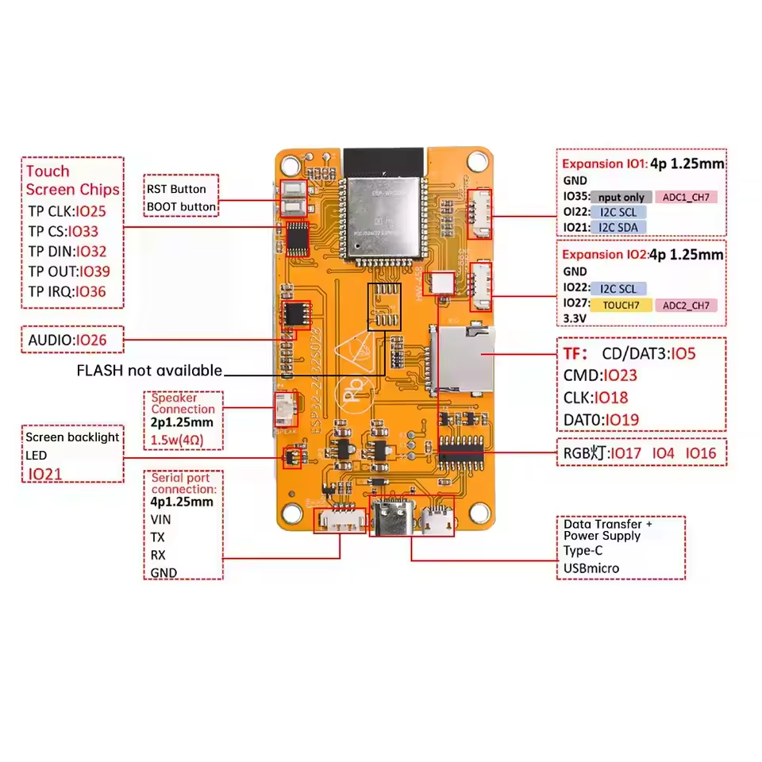

# CYD (Cheap Yellow Display) + LVGL + Touch + WiFi Scanner (ESP32)

This project is a working template for the 2.8" Cheap Yellow Display (CYD) with an
ILI9341 LCD and XPT2046 touch controller. It brings up LVGL, maps touch to the
screen, applies the color fixes needed for correct colors, and includes a WiFi
scanner that displays available networks.

## What this project provides

- LVGL display init + flush callbacks
- Touch input wired to LVGL pointer
- Touch raw calibration mapping to full screen
- Color correction (byte swap + RGB/BGR) for proper colors
- WiFi scanner that refreshes every 2 seconds
- Network list sorted by signal strength
- Display of SSID, signal strength (dBm), and security type

## Hardware

- Board: CYD 2.8" (ILI9341 + XPT2046)
- MCU: ESP32
- Display: 320x240

### Pinout

Wiring diagram:



Pins are defined in `main/cyd_config.h`:

- LCD SPI: `CYD_PIN_NUM_MOSI`, `CYD_PIN_NUM_MISO`, `CYD_PIN_NUM_SCLK`
- LCD control: `CYD_PIN_NUM_LCD_CS`, `CYD_PIN_NUM_LCD_DC`, `CYD_PIN_NUM_LCD_RST`
- Backlight: `CYD_PIN_NUM_BCKL`
- Touch SPI (separate): `CYD_PIN_NUM_TCH_MOSI`, `CYD_PIN_NUM_TCH_MISO`,
  `CYD_PIN_NUM_TCH_SCLK`, `CYD_PIN_NUM_TCH_CS`, `CYD_PIN_NUM_TCH_IRQ`

## Build and flash

```bash
idf.py set-target esp32
idf.py build
idf.py -p /dev/ttyUSB0 flash monitor
```

## Menuconfig notes

Most setups work with defaults, but these are common changes:

- LVGL fonts: enable the sizes you plan to use (e.g. 24 or 32).
  In LVGL config, turn on the font size you want (e.g. `LV_FONT_MONTSERRAT_24`).
- If you see any SPI timing issues, reduce LCD SPI clock in `main/cyd_hw.c`.

## Configuration points (important)

All board-specific settings live in `main/cyd_config.h`.

### Touch mapping

If touch does not reach the edges, update these values:

- `TOUCH_RAW_X_MIN`, `TOUCH_RAW_X_MAX`
- `TOUCH_RAW_Y_MIN`, `TOUCH_RAW_Y_MAX`

These are the raw min/max touch readings for the four corners. The mapping happens
in `main/main.c` via `map_touch_coords()`.

### Color shifting / incorrect colors

The CYD panel often needs color correction. This template applies:

- `LCD_SWAP_COLOR_BYTES` to fix 16-bit byte order
- `LCD_COLOR_SPACE` for RGB/BGR ordering

If colors are wrong, flip these in `main/cyd_config.h`:

- `LCD_COLOR_SPACE` (RGB/BGR)
- `LCD_SWAP_COLOR_BYTES` (0/1)
- `LCD_SWAP_RB` (0/1)

## File layout

```
main/
  main.c            LVGL init, touch mapping, and app_main()
  cyd_hw.c/h        Backlight + LCD + touch init
  cyd_config.h      Pins, calibration, and color settings
  ui.c/h            Basic UI setup (background, labels, cursor)
  wifi_scanner.c/h  WiFi scanning module with auto-refresh UI
```

## Notes

- WiFi scanner runs in a separate FreeRTOS task.
- Networks are sorted by signal strength (strongest first).
- The list refreshes automatically every 2 seconds.
- Touch label and cursor are intentionally kept for quick debugging.
- This repo is intended as a reusable CYD starter template.

# CYD_controller
